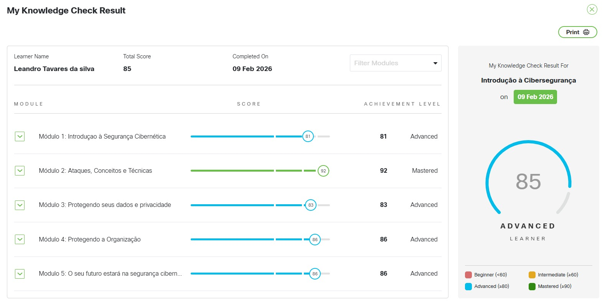
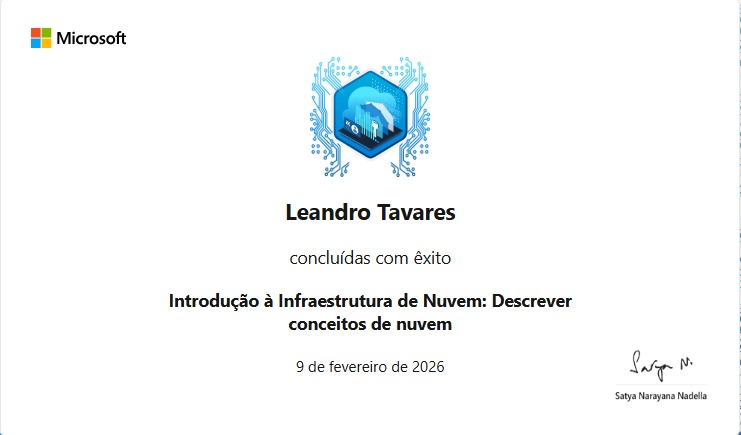
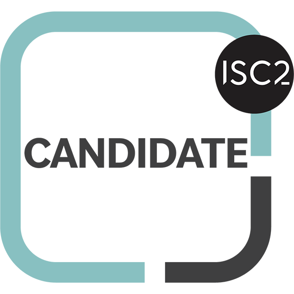

# Certificações e Cursos de TI

Lista de cursos e certificações concluídas em TI e Cibersegurança.

---

## Introdução à Cibersegurança (Introduction to Cybersecurity)
- **Plataforma:** Cisco Networking Academy  
- **Nível:** Advanced / Mastered em módulo de Ataques e Conceitos  
- **Descrição:** Curso introdutório para quem deseja entender os fundamentos da segurança digital. Cobre tipos de malware, engenharia social, proteção de dados pessoais, segurança corporativa e visão geral de carreiras em cibersegurança.  
- **Imagem do Certificado:**  

---

## Introdução à Infraestrutura de Nuvem
- **Plataforma:** Microsoft Learn  
- **Descrição:** Curso sobre fundamentos da computação em nuvem, incluindo conceitos básicos, modelos de serviço (IaaS, PaaS, SaaS), modelos de implantação (nuvem pública, privada, híbrida) e benefícios como escalabilidade, elasticidade e economia de custos.  
- **Imagem do Certificado:**  

---

## Certified in Cybersecurity (CC)
- **Plataforma:** ISC2  
- **Descrição:** Certificação internacional que valida conhecimentos fundamentais em cibersegurança, incluindo princípios de segurança, controle de acesso, segurança de redes, operações de segurança e gestão de riscos. Demonstra base sólida para atuação inicial na área de segurança da informação.  
- **Imagem do Certificado:**  

Fortinet Certified Associate in Cybersecurity (FCA)

**Plataforma: Fortinet
Validade: Fev/2026 – Fev/2028
Nível: Associate (equivalente aos antigos NSE 1, 2 e 3)

Descrição:
Certificação que valida conhecimentos intermediários em cibersegurança com foco em proteção de redes corporativas e operações de segurança (SOC). Abrange políticas de firewall, fundamentos de FortiGate, VPNs, controle de acesso, análise de ameaças, monitoramento e resposta a incidentes, além de boas práticas de segurança para ambientes corporativos.

---

## Fortinet Certified Associate in Cybersecurity (FCA)
- **Plataforma:** Fortinet  
- **Validade:** Fev/2026 – Fev/2028  
- **Nível:** Associate (equivalente aos antigos NSE 1, 2 e 3)  
- **Descrição:** Certificação que valida conhecimentos intermediários em cibersegurança com foco em proteção de redes corporativas e operações de segurança (SOC). Abrange políticas de firewall, fundamentos de FortiGate, VPNs, controle de acesso, análise de ameaças, monitoramento e resposta a incidentes, além de boas práticas de segurança para ambientes corporativos.  
- **Imagem do Certificado:**  

---

## Fortinet Certified Fundamentals in Cybersecurity (FCF)
- **Plataforma:** Fortinet  
- **Validade:** Fev/2026 – Fev/2028  
- **Nível:** Fundamentals  
- **Descrição:** Certificação que valida conhecimentos fundamentais de cibersegurança, incluindo princípios de confidencialidade, integridade e disponibilidade (CIA), identificação de ameaças e vetores de ataque, fundamentos de segurança de redes, criptografia básica, gestão de riscos, segurança de endpoints e boas práticas de proteção de ambientes digitais.  
- **Imagem do Certificado:**  

Perfeito! Seguindo esse modelo, o certificado da IBM fica assim:

---

## Introduction to Cybersecurity Essentials
- **Plataforma:** IBM | Coursera
- **Conclusão:** Mar/2026
- **Nível:** Introdutório
- **Descrição:** Curso que aborda os fundamentos de segurança cibernética, incluindo identificação de ameaças digitais, princípios de proteção de dados, gestão de senhas, autenticação multifator, navegação segura e conceitos básicos de criptografia.
- **Imagem do Certificado:**  

